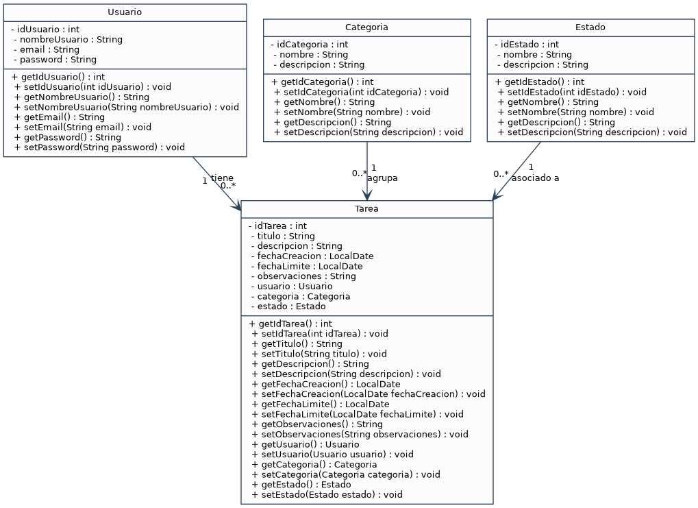

# ¡Hola! Soy Felipe 👋

Soy estudiante de Desarrollo de Aplicaciones Multiplataforma (DAM) y estoy aprendiendo a desarrollar aplicaciones y proyectos de software, mientras sigo mejorando mis conocimientos técnicos. También tengo formación como Técnico en Transporte y Logística, lo que me ha aportado una visión más estructurada y orientada a procesos.

## Tecnologías que estoy aprendiendo
- HTML5
- CSS3
- Java
- Python
- Angular
- Git y GitHub
- Bases de datos

## Mi portfolio
Puedes ver mi portfolio personal aquí:

[Ver portfolio](https://felipedaw1.github.io/mi-portfolio/)

## Diagrama UML de Clases
A continuación se presenta el diagrama UML de clases generado para las clases `Usuario`, `Categoria`, `Estado` y `Tarea`:

### Archivos del diagrama
- [Código fuente de PlantUML (diagrama_uml.puml)](diagrama_uml.puml)
- [Código fuente de Graphviz DOT (diagrama_uml.dot)](diagrama_uml.dot)
- [Diagrama en formato vectorial SVG (diagrama_uml.svg)](diagrama_uml.svg)
- [Diagrama en formato de imagen PNG (diagrama_uml.png)](diagrama_uml.png)

